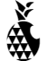

#  Pineapple

## Copy work of apple website.

The looks and design on this website are based on apple's website as of March 2017.

I replicated the work as close as possible, by using my own code as much as possible. I did use chrome dev tools to look at their code, and get an idea of how certain features worked, but only as reference.

The purpose of this side project is to learn from the best.
